# What is Caching?

## The Problem

Imagine you're running a product catalog API for an e-commerce site. Every time someone views a product page, your service queries the database for product details. Simple query, right? `SELECT * FROM products WHERE id = ?`. Takes about 50ms. Not bad.

Now it's Black Friday. You're getting 10,000 requests per second. That's 500,000 milliseconds of database time *per second* - or about 8 minutes of compute time squeezed into every single second. Your database has 100 connections in the pool, each query takes 50ms, you can theoretically handle 2,000 queries per second. You're already 5x over capacity. The connection pool is exhausted. Requests are queuing. Users are seeing spinners. Your phone starts ringing.

Here's the kicker: **98% of those queries are requesting the exact same 100 products**. You're hitting the database 10,000 times per second to return the same data over and over and over. It's like calling your friend to ask for their address every single time you want to send them a letter, instead of just... writing it down somewhere.

Caching is that "somewhere."

---

## What Caching Actually Is

Caching is storing a copy of frequently accessed data in a faster storage layer - closer to your application - so you don't have to fetch it from the slower source every single time.

Think of it like this: Your application normally talks to a database that's sitting on a disk somewhere, maybe even in another data center. That round trip takes time - network latency, disk I/O, query execution. But if you keep a copy of that data in RAM, right next to your application, you can grab it in microseconds instead of milliseconds.

The trade-off is fundamental and inescapable: **Speed vs Freshness**. You can have data really fast (from cache) or you can have it guaranteed fresh (from the source), but you can't perfectly have both. Cached data might be slightly stale. The source is always fresh but slower to access. Every caching decision is about finding the acceptable balance for your use case.

---

## Seeing It In Action

Let me paint you a before-and-after picture.

**Without Cache (The Slow Way)**:
```
User Request 1: App → Database (100ms) → Response
User Request 2: App → Database (100ms) → Response
User Request 3: App → Database (100ms) → Response
Total time: 300ms for 3 requests
Database load: 3 queries
```

**With Cache (The Fast Way)**:
```
User Request 1: App → Cache (miss) → Database (100ms) → Store in Cache → Response
User Request 2: App → Cache (hit!) → Response (2ms)
User Request 3: App → Cache (hit!) → Response (2ms)
Total time: 104ms for 3 requests (71% faster!)
Database load: 1 query (67% reduction!)
```

That first request pays the full cost - cache miss, hit the database, backfill the cache. But requests 2 and 3? Lightning fast. And the database only got hit once instead of three times.

**Key terms you'll hear constantly**:
- **Cache Hit**: You checked the cache, data was there, instant win
- **Cache Miss**: You checked the cache, data wasn't there, now you have to do the slow thing
- **Hit Ratio**: What percentage of requests are cache hits (higher = better, aim for 80%+ in production)
- **TTL (Time To Live)**: How long data lives in the cache before it expires and gets evicted

---

## Visual Flow



Here's what happens on every request:

1. **Request comes in**: User asks for product ID 42
2. **Check cache first**: "Do I already have product 42 in cache?"
3. **Cache Hit Path** (fast): Found it! Return immediately. 2-5ms total.
4. **Cache Miss Path** (slower):
   - Cache doesn't have it
   - Fetch from database (50-500ms)
   - Store a copy in cache for next time
   - Return to user

The first person to request product 42 pays the full cost. Everyone after them gets the express lane.

---

## The Brain Analogy

Your brain is basically a cache.

You memorize your best friend's phone number (cache it in your brain). You don't pull out your phone and look through your contacts every single time you want to call them (hit the database). But if you haven't called your college roommate in 5 years, you've probably forgotten their number (cache eviction due to lack of use). And your brain has limited capacity - you can't memorize every phone number you've ever encountered (cache size limits).

Same principles: fast access for frequently-used data, limited capacity, things you don't use eventually get forgotten.

---

## Caching Exists Everywhere (Seriously, Everywhere)

Once you understand caching, you start seeing it at every single layer of the stack. It's not just Redis. It's *everywhere*.

| Layer | What's Being Cached | Speed | How Long (TTL) |
|-------|-------------------|-------|---------------|
| **Browser** | Static assets (images, CSS, JS), API responses | ~0ms (local disk) | Days to weeks |
| **CDN** | Images, videos, HTML pages | 10-50ms | Hours to days |
| **Application** | In-memory cache (Java HashMap, Go map) | 1-5ms | Minutes to hours |
| **Distributed Cache** | Redis, Memcached between app and DB | 2-10ms | Minutes to hours |
| **Database** | Query result cache, buffer pool | 5-20ms | Dynamic |
| **CPU** | L1/L2/L3 cache for instructions and data | Nanoseconds | Automatic |

When you load a webpage:
1. Your **browser cache** checks if it already has the HTML/CSS/JS
2. If not, the request hits a **CDN** to check for cached assets
3. The CDN might have it cached from a previous user
4. If not, it hits your **app server** which checks its **local cache**
5. If not, the app checks **Redis** (distributed cache)
6. If not, the app queries the **database** (which has its own query cache)
7. The database query results flow back up, getting cached at each layer

Caches all the way down.

---

## When Caching Makes Sense (And When It Doesn't)

Let me tell you when I reach for caching without thinking twice:

**Hell yes, cache this**:
- ✅ **Read-heavy workloads**: Read:write ratio of 10:1 or higher. Product catalogs, user profiles, config data.
- ✅ **Expensive operations**: That thing that takes 200ms to compute or fetch? Cache it. Now it takes 2ms.
- ✅ **Staleness is tolerable**: Can your users handle data that's 5 minutes old? Cache it.
- ✅ **Shared data**: Multiple users requesting the same thing. One DB hit serves thousands of users.

**Do NOT cache this**:
- ❌ **Write-heavy workloads**: If data changes constantly, you'll spend more time invalidating cache than you save. Live stock prices, real-time sports scores - skip caching.
- ❌ **Unique per request**: If every user requests different data that never repeats, caching wastes memory with zero reuse.
- ❌ **Critical consistency**: Financial transactions, inventory counts - if stale data causes real problems, don't cache.
- ❌ **Cheaper to recompute**: If fetching from cache costs more than just doing the operation again (rare, but happens with huge objects), skip it.

---

## Common Use Cases (Steal These)

Here are patterns I've seen work in production systems:

1. **API Response Caching**: External weather API? Currency exchange rates? Payment gateway responses? Cache them. Rate limits thank you.

2. **Database Query Results**: Frequent SELECT queries that return the same data? Cache them. Your DBA thanks you.

3. **Expensive Computations**: Recommendation algorithms taking 2 seconds? ML model inference taking 500ms? Cache the results.

4. **User Session Data**: Auth tokens, user preferences, shopping cart contents - cache them in Redis.

5. **Static Assets**: Images, CSS, JS files - CDN caching makes your site feel instant.

6. **Configuration**: Feature flags, app settings - cache them in-memory, refresh every 30 seconds.

---

## FAQ: "Wait, I Thought Caching Was Just For Databases?"

Nope! This is the most common misconception I see. You can cache **any expensive operation**.

Think about what "expensive" means: slow network calls, complex computations, disk I/O, anything that takes time and gets requested repeatedly. Database queries are just one example - the most common one, sure, but not the only one.

**What you can cache:**

| Data Source | Example | Why Cache It? | Latency Savings |
|-------------|---------|---------------|-----------------|
| **Database** | User profile query | Reduce DB load | 50-500ms → 2ms |
| **External APIs** | Weather API, Payment gateway | Rate limits, cost per call | 100-2000ms → 2ms |
| **Microservice Calls** | Auth service, Product service | Network hops | 20-200ms → 2ms |
| **Expensive Computations** | Recommendation engine, ML inference | Avoid re-computing | 100-5000ms → 2ms |
| **File System** | Config files, templates | Disk I/O | 10-100ms → 2ms |
| **DNS Lookups** | Domain → IP resolution | Network latency | 20-100ms → 2ms |
| **Static Assets** | Images, CSS, JS | Bandwidth, CDN cost | Varies → instant |

**Real-world examples I've built or seen**:

- **External API**: Cache currency exchange rates for 1 hour. The API has rate limits (100 calls/hour) and charges per request. Cache one call, serve 10,000 users.

- **Computation**: Netflix caches recommendation results. Their algorithm takes 2 seconds to run. Cache it for an hour, users see recommendations in 5ms every time they visit.

- **Microservice**: Order service caches user data from User service. Instead of calling User service on every order (adding 50ms + network unreliability), cache it locally for 5 minutes.

- **Configuration**: Feature flags checked on every API request. Don't hit the database 10,000 times per second. Cache feature flags in-memory, refresh every 30 seconds.

**The universal pattern**: If it's SLOW and ACCESSED FREQUENTLY → Cache it.

Database queries are just the most obvious example. But caching applies to *everything* that's expensive to fetch or compute.

---

## The Famous Quote

> "There are only two hard problems in Computer Science: cache invalidation and naming things."
> — Phil Karlton

People love quoting this because it's funny and painfully true.

Cache invalidation is hard because:
- **How do you know when cached data is stale?** The source changed but the cache doesn't know.
- **How do you update or remove stale data across distributed systems?** You have 100 app servers, each with their own local cache. Database gets updated. How do you tell all 100 servers?
- **What if your invalidation logic has bugs?** Now users see old data and you don't even realize it.

We'll cover invalidation strategies in Topic #4. For now, just know: getting data *into* cache is easy. Knowing when to *remove* it is where things get interesting.

---

## Interview Talking Points

When someone asks about caching in a system design interview, here's the rhythm:

**Interviewer**: "How would you handle 10,000 requests per second?"

**You**: "First thing I'd look at is caching. I'd ask: what's the read-to-write ratio? If we're reading data way more than writing it, caching can massively reduce load."

**Interviewer**: "Assume it's read-heavy."

**You**: "Great. I'd introduce a caching layer - probably Redis - between the application and the database. We'd cache query results with appropriate TTLs. This gives us two wins: reduced latency (database queries are 100ms, cache hits are 2ms) and reduced database load (90% hit ratio means the DB only handles 10% of traffic instead of 100%)."

**Interviewer**: "What about data consistency?"

**You**: "That's the trade-off. Cached data might be slightly stale. I'd ask: can we tolerate 5 minutes of staleness? If yes, we set TTL to 5 minutes. If no, we need cache invalidation on writes, which adds complexity. The question is: is speed vs freshness - we need to know the business requirements to make the right call."

**Key points to always mention**:
1. The **fundamental trade-off**: Speed vs freshness
2. Ask about **access patterns**: "What's the read:write ratio?"
3. **Consistency requirements**: "Can we tolerate stale data?"
4. **Scale context**: "Is this data shared across users or unique per user?"
5. **Hit ratio expectations**: "We'd aim for 80%+ hit ratio to justify the complexity"

---

## Related Concepts
- **[Next: 02-benefits-and-tradeoffs.md](02-benefits-and-tradeoffs.md)** - When caching is worth the complexity
- **[Topic 04: Invalidation Strategies](04-invalidation-strategies.md)** - The hardest problem in computer science
- **[Topic 09: Cache Topologies](09-cache-topologies.md)** - Where to place your cache (local, distributed, layered)

---

*Last updated: 2026-03-29*
*Status: ✅ Complete (Revised)*
