# Benefits and Tradeoffs of Caching

## The Problem

You've just added caching to your microservice. Redis is humming, hit ratio is at 87%, and database load dropped by 80%. You're feeling like a hero. You present the results in the team meeting: "Response time went from 150ms to 8ms!" Everyone's impressed.

Then two weeks later, you're in an incident call. Users are reporting stale data. Someone updated their profile picture an hour ago but they're still seeing the old one. Customer support is getting angry emails. You realize your cache TTL is too long, but you can't just lower it because then your hit ratio tanks and the database starts struggling again. Now you need cache invalidation logic, which means writing code to bust the cache on every write operation across 6 different microservices. The simple change that made things faster has now made your system more complex, harder to debug, and occasionally shows users wrong information.

This is the caching tradeoff in action. Caching isn't free. You're not just "making things faster" - you're trading one set of problems (slow, high load) for a different set of problems (staleness, complexity, memory cost). The question is always: **Is this trade worth it for your specific use case?**

---

## The Core Trade-Off (What You're Actually Trading)

When you add caching, here's what you're really doing:

**You give up**:
- **Memory**: RAM is expensive, and you're using it to store duplicate data
- **Consistency**: Cached data might not match the source - users might see stale data
- **Complexity**: More moving parts, more things to break, harder to debug

**You get back**:
- **Speed**: Milliseconds instead of hundreds of milliseconds
- **Reduced load**: Database/API handles 10-90% less traffic
- **Cost savings**: Fewer API calls, smaller database instances, less bandwidth

The art is knowing when the benefits outweigh the costs.

---

## The Benefits (Why We Cache)

Let me walk through the wins I've seen from well-implemented caching in production systems.

### 1. Reduced Latency - The Speed Win

This is the obvious one, but the numbers are still wild when you see them in production.

Picture a database query that takes 100ms. Not terrible, right? But now add caching with Redis. Cache hit? 2ms. **That's 50x faster**. User experience goes from "okay" to "instant."

Real examples from systems I've worked on:
- **Database queries**: 150ms → 5ms (30x faster)
- **External API calls**: 800ms → 5ms (160x faster)
- **Complex computations** (recommendation engine): 2000ms → 5ms (400x faster)

The impact is visceral. Users notice. Page loads that felt sluggish suddenly feel snappy. Mobile apps on slow networks become usable because most data comes from cache instead of over the network.

### 2. Increased Throughput - The Scale Win

Here's where caching gets really interesting from a systems perspective.

Imagine your database can handle 1,000 queries per second before it starts sweating. Without caching, that's your ceiling. 1,000 req/sec maximum throughput.

Now add caching with an 80% hit ratio. Suddenly, 80% of requests (800/sec) never touch the database - they're served from cache. Your database only sees 200 queries/sec. **You just 5x'd your effective capacity** without adding a single database server.

With a 90% hit ratio? Your database sees 100 queries/sec. **You've 10x'd your capacity.** Same infrastructure, same database, 10x the throughput. That's the scaling magic of caching.

Real example: We went from 5,000 req/sec to 50,000 req/sec on the same infrastructure by introducing Redis with 90% hit ratio. Saved us from having to add 9 more database replicas.

### 3. Reduced Database Load - The Breathing Room Win

Even if you don't care about throughput right now, caching gives your database breathing room.

Think about it: if 90% of your read traffic never touches the database, your DB can focus on what it's good at - handling writes and complex transactions. Write operations don't have to fight with read operations for connection pool slots. Replication lag improves because there's less load. Query optimizer has more CPU budget for complex queries.

I've seen databases go from 85% CPU utilization (scary territory) to 20% CPU (comfortable cruising altitude) just by adding a caching layer. Same traffic, same queries, just intercepted before they hit the database.

### 4. Cost Savings - The Money Win

Let me paint a concrete scenario: You're using a third-party API. Weather data, payment processing, geolocation, whatever. They charge $0.001 per request. You get 10 million requests per month. That's **$10,000/month** in API costs.

Now add caching. Weather data doesn't change every second - you can safely cache it for 10 minutes. Suddenly, instead of 10 million API calls, you make maybe 500,000 (95% hit ratio). **Your bill drops from $10,000/month to $500/month.**

Or infrastructure costs: Your database needs 8 replicas to handle read traffic. Add caching, hit ratio is 85%, now you only need 2 replicas. Depending on your cloud provider and instance size, that could be $5,000-$15,000/month in savings.

Caching pays for itself, often massively.

### 5. Improved Reliability - The Resilience Win

Here's an underrated benefit: cache acts as a buffer when things go wrong.

Imagine your database has a slowdown - queries spike from 50ms to 500ms. Without caching, every single user request immediately feels that pain. Response times spike, users see spinners, maybe timeout errors.

With caching? 80-90% of requests don't even touch the database - they're served from cache at full speed. Only the 10-20% of cache misses feel the pain. Your system degraded, but it didn't fall over.

Or even better: database goes completely down. Without caching, your entire service is dead. With caching configured to serve stale data on errors, you can keep serving 80-90% of requests with slightly stale data while you fix the database. Users see a degraded experience instead of error pages.

**The pattern**: "Serve stale data rather than fail completely."

---

## The Hidden Costs (Why Caching Can Hurt)

Now let me tell you about the times caching has burned me or my teams.

### 1. Memory Cost - The Money You Don't See

RAM is expensive. A Redis instance with 32GB of memory costs $200-500/month depending on your cloud provider. If you need high availability (replicas), double that.

And memory is a hard limit. Once your cache fills up, you're evicting things (which we'll cover in Topic 3), and your hit ratio drops. Need more memory? Spin up a bigger instance or add nodes. More money.

Compare this to databases that can store terabytes on disk cheaply. Cache only lives in RAM, which means you're limited by cost. You have to be strategic about what you cache.

### 2. Complexity Tax - The Time Sink

This is the one that hurts teams the most, in my experience.

Before caching: User updates profile → Database updated → Next request sees new profile. Simple.

After caching: User updates profile → Database updated → **Cache needs invalidation** → But which cache keys? → And you have 50 app servers each with local caches → Do you invalidate via pub/sub? → What if a message is dropped? → Now some users see old data, some see new data → Debugging this is a nightmare.

I've seen teams spend more time debugging cache invalidation bugs than they saved from the performance improvement. The symptom is always the same: "Some users see the old data, but refreshing fixes it." That's stale cache data.

**The quote everyone knows**: "There are only two hard problems in Computer Science: cache invalidation and naming things." — It's funny because it's true and painful.

### 3. Stale Data Risk - The User Trust Killer

Stale data bugs are insidious because they're intermittent and hard to reproduce.

Real story: We cached user profile data with a 5-minute TTL. A user updated their profile picture. They refreshed the page. Old picture. Refreshed again 30 seconds later. Still old picture. Refreshed 5 minutes later. New picture appears. The user filed a bug: "Profile picture update is broken."

From the system's perspective, everything worked correctly. Cache had a 5-minute TTL, data refreshed after 5 minutes. But from the user's perspective, their update didn't work for 5 minutes. That's a broken experience.

Multiply this across different data types (profile info, cart contents, settings) and different cache layers (browser, CDN, app, Redis), and debugging "why is this user seeing old data?" becomes a multi-hour investigation.

### 4. Operational Overhead - The Hidden Labor

Adding caching adds operational burden:
- **Monitoring**: Need to track hit ratio, eviction rate, memory usage, latency
- **Alerting**: Need alerts when hit ratio drops, memory fills up, cache cluster degrades
- **Tuning**: Need to experiment with TTLs, cache sizes, eviction policies
- **Maintenance**: Need to update, patch, restart cache servers
- **Debugging**: Need to check if production issues are cache-related

That's another service in your stack that can fail, needs capacity planning, requires on-call rotation, shows up in incident postmortems.

Is it worth it? Sometimes yes, sometimes no. Depends on your team size and the wins you're getting.

### 5. Thundering Herd - The Cascading Failure Scenario

Here's a scenario that's bitten me: You cache a popular piece of data with a 10-minute TTL. At 9:00 AM, the cache expires. Suddenly, 1000 concurrent requests all see a cache miss at the exact same time. All 1000 requests slam the database simultaneously.

Your database has 100 connections in the pool. Now there are 1000 queries queued. Database CPU spikes to 100%. Queries start timing out. More cache misses because queries are slow. More requests hit the database. **Cascading failure.**

This is the "thundering herd" or "cache stampede" problem. We'll cover prevention in Topic #13, but for now, just know: cache expiration can cause traffic spikes that overload your backend.

### 6. Cache Warming - The Deploy Headache

Imagine you deploy a new version of your service. All instances restart. Caches are now empty - "cold." The first wave of traffic after deploy gets 0% hit ratio. Every single request hits the database.

If your database was comfortably handling 10% of traffic (because 90% was cached), it's now seeing 100% of traffic. **10x spike in database load**. Queries slow down. Timeouts happen. Maybe the database falls over completely.

This is called the "cold cache problem." You need cache warming strategies - pre-populating the cache before taking traffic. That's extra deployment complexity, extra code, extra things to maintain.

---

## Visual Comparison

Both sides are real. The question is: do the benefits outweigh the costs for your specific use case?

---

## When Caching Is Worth It (The High-Value Scenarios)

Let me walk through scenarios where I don't even think twice - caching is clearly the right move.

**Scenario 1: E-commerce Product Catalog**
- **Read:Write ratio**: 10,000:1 (products viewed constantly, updated rarely)
- **Operation cost**: 200ms database query
- **Staleness tolerance**: 5 minutes old is totally fine
- **Result**: 95% hit ratio, 200ms → 5ms latency, database load drops 95%
- **Verdict**: Hell yes, cache it. The wins are huge, the staleness doesn't matter.

**Scenario 2: Weather API Aggregation**
- **API cost**: $0.01 per call
- **Traffic**: 100,000 requests/day = $1,000/day
- **Staleness tolerance**: Weather doesn't change every minute, 15-minute cache is fine
- **Result**: 95% cache hit ratio, $1,000/day → $50/day in API costs
- **Verdict**: Cache it. Saves $950/day. The ROI is immediate.

**Scenario 3: Expensive Computation (Recommendation Engine)**
- **Computation time**: 2000ms
- **Read:Write ratio**: 100:1 (users view recommendations way more than we recompute them)
- **Staleness tolerance**: Recommendations from an hour ago are still pretty good
- **Result**: 2000ms → 5ms, users see instant recommendations
- **Verdict**: Cache it. 400x speedup, users don't care if recommendations are an hour old.

**Pattern**: Read-heavy workload + expensive operation + tolerable staleness = cache it.

---

## When Caching Is NOT Worth It (The Traps)

Now let me show you scenarios where caching either doesn't help or actively hurts.

**Scenario 1: Real-time Stock Prices**
- **Write frequency**: Prices update every second
- **Staleness tolerance**: Zero - users need live data
- **Cache behavior**: Data is stale within 1 second of caching
- **Result**: Cache adds complexity, still serves stale data, users complain
- **Verdict**: Don't cache. Staleness is unacceptable. Stream the data instead.

**Scenario 2: User-Specific Recommendations (No Reuse)**
- **Access pattern**: Each user gets unique recommendations
- **Reuse**: Zero - no other user will request the same data
- **Cache behavior**: Every request is a cache miss (0% hit ratio)
- **Result**: Wasting memory on data that's never reused
- **Verdict**: Don't cache. No hit ratio means no benefit, just wasted RAM.

**Scenario 3: Fast Operations (< 10ms)**
- **Operation cost**: In-memory lookup takes 5ms
- **Cache overhead**: Redis network call takes 2ms + serialization overhead
- **Result**: Cache might be slower than just doing the operation
- **Verdict**: Don't cache. You're not saving enough time to justify complexity.

**Scenario 4: Write-Heavy Workload**
- **Read:Write ratio**: 1:5 (way more writes than reads)
- **Cache behavior**: Constantly invalidating cache on writes
- **Result**: Low hit ratio (maybe 30%), high complexity from invalidation logic
- **Verdict**: Don't cache. The write invalidation overhead exceeds the read benefits.

**Pattern**: Low read:write ratio OR no staleness tolerance OR no data reuse = skip caching.

---

## Decision Framework (How I Think About This)

Here's the mental checklist I run through when someone proposes adding caching:

**Question 1: What's the read:write ratio?**
- **> 10:1** → Caching probably helps a lot
- **3:1 to 10:1** → Caching might help, need to measure
- **< 3:1** → Probably not worth it, too much write invalidation

**Question 2: How expensive is the operation?**
- **> 100ms** → High-value caching target
- **10-100ms** → Medium value, depends on traffic volume
- **< 10ms** → Low value, probably not worth complexity

**Question 3: Can you tolerate stale data? How stale?**
- **Yes, 10+ minutes** → Easy caching win, long TTLs
- **Yes, 1-5 minutes** → Still good for caching, moderate TTLs
- **No, must be real-time** → Don't cache, or need complex invalidation

**Question 4: Is the data reused across requests/users?**
- **Yes, many users request same data** → Great hit ratio expected
- **Somewhat, same user re-requests** → Decent hit ratio
- **No, every request is unique** → 0% hit ratio, don't cache

**Question 5: What's your team's operational capacity?**
- **Large team, mature ops** → Can handle caching complexity
- **Small team, limited ops** → Simplicity might be more valuable than speed

**The 80/20 rule**: If you answer "yes" to questions 1, 2, 3, and 4, caching will probably give you 80% of the possible benefit with 20% of the edge-case complexity.

---

## The Fundamental Law

Here's the truth I wish someone had told me earlier in my career:

> **"Caching should make your system simpler to operate, not more complex."**

If you find yourself spending more time debugging cache invalidation bugs, tuning TTLs, hunting down stale data issues, and explaining to stakeholders why users are seeing old data than you're saving in performance wins, you've crossed the complexity threshold. You added caching when you shouldn't have, or you implemented it wrong.

Good caching disappears. You set it up once, tune it a bit, and it just works. Hit ratio stays high, staleness is tolerable, operations are smooth. You rarely think about it.

Bad caching is a constant source of pain. You're always tweaking TTLs, debugging staleness issues, explaining cache misses, worrying about thundering herds. It's a tar pit.

Know the difference.

---

## Interview Talking Points

When caching comes up in a system design interview, here's how to navigate it:

**Interviewer**: "How would you improve performance of this API?"

**You**: "First question: what's the read-to-write ratio? If this is read-heavy - say 10:1 or higher - caching is probably the highest-leverage thing we can do. We could introduce a caching layer like Redis between the app and database."

**Interviewer**: "What are the trade-offs?"

**You**: "Main trade-off is speed versus consistency. Caching gives us massive latency reduction - we could go from 150ms database queries to 5ms cache hits, a 30x speedup. But cached data might be stale. I'd need to ask: can the business tolerate data being 5 minutes old? If yes, we set TTL to 5 minutes and we're good. If no, we need cache invalidation logic on writes, which adds complexity."

**Interviewer**: "What about cost?"

**You**: "Caching has costs - we need to provision Redis (memory isn't free), and there's operational overhead (monitoring, tuning, debugging stale data issues). But the benefits are huge: reduced database load (90% hit ratio means DB only handles 10% of traffic), cost savings (fewer API calls if we're caching external data), and improved reliability (cache can serve stale data if the database has issues). At scale, caching typically pays for itself many times over."

**Key points to hit**:
1. **Always ask about read:write ratio** - that's the #1 factor
2. **Mention the staleness trade-off** - can't have speed and perfect freshness
3. **Quantify the wins** - "30x latency improvement", "90% load reduction"
4. **Acknowledge the costs** - memory, complexity, operational overhead
5. **Tie it to business requirements** - "depends on whether we can tolerate staleness"

---

## Related Concepts
- **[Previous: 01-what-is-caching.md](01-what-is-caching.md)** - Core caching concepts
- **[Next: 03-eviction-policies.md](03-eviction-policies.md)** - Managing limited cache space
- **[Topic 13: Cache Stampede](13-cache-stampede.md)** - Thundering herd problem and prevention

---

*Last updated: 2026-03-29*
*Status: ✅ Complete (Revised)*
