# Cache Eviction Policies

## What It Is
- Algorithm that decides **which cached item to remove** when cache is full
- Required because caches have limited memory
- Wrong policy can drop hit ratio from 90% → 30%

## The Core Question
**Which cached item is least valuable right now?**

Different policies have different answers:
- **LRU**: Least recently used
- **LFU**: Least frequently used
- **FIFO**: Oldest item
- **Random**: Pick randomly
- **TTL**: Expired items

## LRU (Least Recently Used)

**Most Popular Policy**

**What It Does:**
- Removes item that hasn't been accessed for the longest time
- Maintains access timestamp for each item
- Every cache hit updates timestamp

**When To Use:**
- ✅ Temporal locality (recent items accessed again soon)
- ✅ General-purpose caching (safe default)
- ✅ Session data, user preferences, recent queries

**When To Avoid:**
- ❌ Sequential scans (one-time reads pollute cache)
- ❌ Periodic patterns (weekly reports evicted before next use)

**Performance:**
- Time: O(1) with doubly-linked list + hashmap
- Space: O(n)
- Typical Hit Ratio: 90-95%

**Examples:**
- Redis: `allkeys-lru`
- Web browser cache

## LFU (Least Frequently Used)

**What It Does:**
- Removes item accessed the fewest times
- Maintains access counter for each item
- Every cache hit increments counter

**When To Use:**
- ✅ Power-law distribution (few items very popular)
- ✅ Long-lived cache where frequency > recency
- ✅ Popular content (trending videos, top products)

**When To Avoid:**
- ❌ Access patterns change over time (stale popular items stick)
- ❌ One-time viral items (high counter, no longer accessed)

**The Problem:**
- **Stale Popular Item**: Item popular yesterday (high counter), not accessed today, still occupies cache
- **Solution**: LFU with decay (reduce counters over time)

**Performance:**
- Time: O(log n) with min-heap
- Space: O(n)
- Typical Hit Ratio: 85-90%

**Examples:**
- CDN caching for popular videos
- Redis: `allkeys-lfu`

## FIFO (First In, First Out)

**What It Does:**
- Removes oldest item, regardless of access patterns
- Simple queue behavior
- No tracking of access patterns

**When To Use:**
- ✅ Simple, predictable eviction needed
- ✅ All items have similar value
- ✅ Temporary buffers (logs, message queues)

**When To Avoid:**
- ❌ Variable access patterns (ignores popularity)
- ❌ Need high hit ratio (LRU/LFU perform better)

**Performance:**
- Time: O(1) with queue
- Space: O(n)
- Typical Hit Ratio: 60-70%

**Examples:**
- Message queues
- Log rotation

## Random Eviction

**What It Does:**
- Picks random item to evict
- No metadata tracking
- No coordination needed

**Surprising Facts:**
- Random is **80-90% as good as LRU** in many workloads
- Much simpler to implement (10 lines of code)
- No pathological worst cases
- No metadata overhead

**When To Use:**
- ✅ Simplicity > optimal hit ratio
- ✅ Distributed caches (coordination is expensive)
- ✅ Avoiding worst-case patterns

**When To Avoid:**
- ❌ Need maximum hit ratio
- ❌ Clear hot/cold data patterns

**Performance:**
- Time: O(1)
- Space: O(1) - no metadata
- Typical Hit Ratio: 70-80%

**Examples:**
- Memcached
- Redis: `allkeys-random`

## TTL (Time To Live)

**What It Does:**
- Removes items that have expired based on time limit
- Each item has expiration timestamp
- Background process scans for expired items
- Often combined with other policies (LRU + TTL)

**When To Use:**
- ✅ Data has natural expiration (API rate limits, session tokens)
- ✅ Freshness is critical (stock prices, weather)
- ✅ Regulatory requirements (delete after X days)

**TTL Patterns:**
- **Short (seconds/minutes)**: Real-time data, auth tokens
- **Medium (hours)**: API responses, computed results
- **Long (days)**: Static assets, config data

**Performance:**
- Time: O(1) to check, O(n) for cleanup
- Space: O(n)
- Typical Hit Ratio: 80-90%

**Examples:**
- Redis `EXPIRE` command
- HTTP `Cache-Control: max-age=3600`
- JWT tokens with `exp` claim

## Visual Comparison

## Policy Comparison Table

| Policy | Best For | Hit Ratio | Complexity | Memory |
|--------|----------|-----------|------------|--------|
| **LRU** | General purpose, temporal locality | ⭐⭐⭐⭐⭐ | Medium | O(n) |
| **LFU** | Popular items, power-law | ⭐⭐⭐⭐ | High | O(n) |
| **TTL** | Time-sensitive, freshness | ⭐⭐⭐⭐ | Low | O(n) |
| **Random** | Simplicity, distributed | ⭐⭐⭐ | Very Low | O(1) |
| **FIFO** | Simple queues, equal value | ⭐⭐ | Low | O(n) |

## Hybrid Approaches

### LRU + TTL (Most Common)
- LRU handles eviction when cache is full
- TTL ensures freshness (prevents stale data)
- **Best of both worlds**
- Example: Redis with `allkeys-lru` + `EXPIRE`

### Segmented LRU
- Split cache into "hot" and "cold" sections
- New items start in cold section
- Promoted to hot on second access
- Prevents one-time scans from polluting cache
- Example: Caffeine (Java caching library)

### Adaptive Replacement Cache (ARC)
- Dynamically balances between LRU and LFU
- Learns from workload patterns
- Self-tuning based on hit/miss history
- Example: PostgreSQL buffer pool

## Real-World Scenarios

**Scenario 1: API Response Cache**
- Pattern: Some endpoints 100x more popular
- Lifetime: Changes every 5 minutes
- **Best choice**: LRU + TTL (5 min)
- **Why**: Popular APIs stay (LRU), stale data expires (TTL)

**Scenario 2: User Session Cache**
- Pattern: Active users access repeatedly
- Lifetime: Expire after 30 min inactivity
- **Best choice**: LRU + TTL (30 min sliding)
- **Why**: Active sessions cached, inactive expire

**Scenario 3: CDN Video Streaming**
- Pattern: Power-law (top 1% = 90% traffic)
- Lifetime: Videos are immutable
- **Best choice**: LFU
- **Why**: Keep most frequently accessed videos

**Scenario 4: Log Aggregation Buffer**
- Pattern: Write once, read once, discard
- Lifetime: Processed within seconds
- **Best choice**: FIFO
- **Why**: Simple queue semantics

## Decision Framework: How To Choose

### The Key Question
**"What makes data valuable in my cache?"**

Different answers → Different policies:

### 1. "Recently accessed data will be accessed again soon"
**→ Use LRU**
- **Pattern**: Temporal locality (users browse back/forth)
- **Examples**: E-commerce browsing, user sessions, API responses
- **Why LRU wins**: Keeps recently-touched items hot

### 2. "Frequently accessed data is more valuable"
**→ Use LFU**
- **Pattern**: Power-law distribution (top 1% = 90% traffic)
- **Examples**: Video streaming (Netflix/YouTube), CDN content
- **Why LFU wins**: Popular content stays regardless of recency

### 3. "All data has equal value"
**→ Use FIFO**
- **Pattern**: Write-once, read-once, discard
- **Examples**: Log buffers, message queues
- **Why FIFO works**: Simple queue semantics, no hot/cold distinction

### Critical Distinction: LRU vs LFU

**When frequency and recency align** → LRU is simpler (O(1) vs O(log n))
- API Gateway: Popular endpoints are BOTH frequent AND recent

**When frequency and recency diverge** → LFU wins
- Video CDN: Old popular movie (high frequency, not recent) vs viral video yesterday (recent, low frequency)

## Key Takeaways
- ✅ **Default to LRU + TTL** - works for 90% of cases
- ✅ **Wrong policy = 3x worse hit ratio** (seen 92% → 35%)
- ✅ **Random is shockingly good** - 80-90% of LRU's performance, 1% complexity
- ✅ **LFU + decay** for power-law patterns (prevents stale popular items)
- ✅ **TTL mandatory** for time-sensitive data
- ⚠️ **Sequential scans kill LRU** - consider segmented caching

## Interview Talking Points

### When Asked: "How would you design the cache eviction policy?"

**Step 1: Ask about access patterns**

**You:** "I'd need to understand the access patterns first. Are we seeing the same data accessed repeatedly (temporal locality)? Or is there a power-law distribution where top 1% of items get 90% of traffic?"

**Step 2: Default recommendation**

**You:** "I'd default to **LRU + TTL**. LRU handles eviction when memory fills up by removing least-recently-used items, which works well for temporal locality patterns we see in most web applications. TTL ensures we're not serving stale responses beyond their valid lifetime. We'd implement with a doubly-linked list + hashmap for O(1) access and eviction."

**Step 3: Explain the reasoning**

**You:** "LRU works because popular endpoints are BOTH frequently AND recently accessed. If an endpoint gets 1000 hits/day, it's constantly recent, so LRU keeps it cached. If traffic shifts away from an endpoint, LRU automatically evicts it. This adaptability is key."

### If Asked: "Why not LFU?"

**You:** "LFU has the stale popular item problem. If an endpoint was viral yesterday but traffic shifted today, LFU keeps it cached due to high historical counter. LRU adapts faster - if that endpoint isn't used recently, it gets evicted."

**Follow-up:** "However, if we had a video CDN with power-law distribution - where popular content stays popular for weeks/months - then LFU with decay would be better. The key is whether frequency and recency align or diverge."

### If Asked: "What about Random?"

**You:** "Random is surprisingly effective - gets 80-90% of LRU's hit ratio with way less complexity. For a distributed cache across 100 nodes where coordination is expensive, Random would be compelling. But for centralized Redis with predictable patterns, LRU gives 10-15% better hit ratio without much complexity."

### Scenario-Based Answer

**Interviewer:** "API gateway caching responses from 50K endpoints. Top 5% get most traffic. Which policy?"

**You:** "I'd start with **LRU + TTL**. Here's why: those top 5% endpoints aren't just frequently accessed - they're constantly accessed throughout the day, making them both frequent AND recent. LRU handles this perfectly. If we later see that certain endpoints stay popular for weeks regardless of daily patterns, we could switch to LFU with decay. But LRU is the safer starting point - simpler (O(1)), battle-tested, and handles 90% of cases."

**Why LFU wouldn't be first choice:** "For API gateway, traffic patterns can shift quickly. A campaign endpoint might be hot today, cold tomorrow. LRU adapts immediately. LFU would keep yesterday's hot endpoint cached until its counter decays."

## Related Concepts
- **[Previous: 02-benefits-and-tradeoffs.md](02-benefits-and-tradeoffs.md)** - When caching is worth it
- **[Next: 04-invalidation-strategies.md](04-invalidation-strategies.md)** - The hardest problem
- **[Topic 09: Cache Topologies](09-cache-topologies.md)** - Where eviction happens

---

*Last updated: 2026-03-30*
*Status: ✅ Complete (Concise Reference)*
